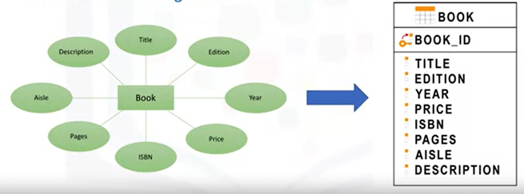
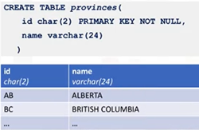

# Introduction to Relational Databases and Tables

## Relational Database Concepts

### Relational Model
Data is stored in tables. This provides logical data independence, physical data independence, and physical storage independence.

### Entity-Relationship (ER) Model
ER models are used as a tool to design relational databases. The building blocks of an ER diagram are **entities** and **attributes**.

Entities are drawn as rectangles, and attributes as ovals, as shown below.  

  

A database can be thought of as a collection of entities, rather than being used as a model on its own. Entities are objects that independently of any other entities in the database (that have attributes).

In the above example, each attribute is connected to exactly one entity (Book), so this will become a table in the database, and the attributes will be the columns. 

In an ER model:
- **ENTITIES** map to **TABLES** in a relational database
- **ATTRIBUTES** map to **COLUMNS** in a table
- A **PRIMARY KEY** uniquely identifies a specific row in a table.

## Types of SQL statements (DDL vs. DML)
SQL Statements are used for interacting with entities (tables), attributes (columns), and their tuples (or rows with data values) in relational databases. 
SQL statements fall into two different categories: 
- Data Definition Language (DDL) statements 
- Data Manipulation Language (DML) statements

### DDL Statements
DDL statements are used to define, change, or drop database objects such as tables. Common DDL statement types include the following:

#### `CREATE`
Used for creating tables and defining its columns:

    CREATE TABLE table_name (
      column1 datatype,
      column2 datatype,
      column3 datatype,
      ....
    );

  

#### `ALTER`
Used for altering tables including adding and dropping columns and modifying their datatypes

    ALTER TABLE table_name
    ADD COLUMN column_name data_type column_constraint;

    ALTER TABLE table_name
    DROP COLUMN column_name;

    ALTER TABLE table_name
    ALTER COLUMN column_name SET DATA TYPE data_type;

    ALTER TABLE table_name
    RENAME COLUMN current_column_name TO new_column_name;

(Note that unlike the CREATE statement, parentheses are not used to enclose the statement)
Each row in the `ALTER TABLE` statement specifies one change that you want to make to the table.

#### `TRUNCATE`
Used for deleting data in a table but not the table itself. This will delete all the rows in a table, but not the table itself.
    
    TRUNCATE TABLE table_name IMMEDIATE;

#### `DROP`
Used for deleting tables. 

    DROP TABLE table_name;

### DML Statements
DML statements are used to read and modify data in tables. These are also sometimes referred to as **CRUD** operations, that is, **Create, Read, Update and Delete** rows in a table. Common DML statement types include:
- `INSERT` - used for inserting a row or several rows of data into a table
- `SELECT` - reads or selects row or rows from a table
- `UPDATE` - edits row or rows in a table
- `DELETE` - removes a row or rows of data from a table
