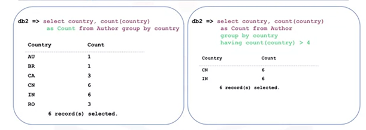

# String Patterns, Ranges, Sorting, and Grouping

## Simplifying `SELECT` Statements

### String Patterns
The `LIKE` predicate is used in a `WHERE` clause to search for a pattern in a column. The percent sign is used to define missing letters. The percent sign can be placed before the pattern, after the pattern, or both before and after the pattern. For example,
      
      SELECT firstname from Author
        WHERE firstname LIKE ‘R%’ ;
        
Will select all first names in the Author table that starts with R.

This is also useful for finding values within a range of dates, e.g. 

      SELECT F_NAME, L_NAME from EMPLOYEES
        WHERE B_DATE LIKE '197%' ;
	
Will select names of employees with birth dates in the 1970s.

### Ranges
Instead of writing something like
	
      SELECT title, pages from Book
	WHERE pages >=290 AND pages <=300 ;
        
the **between and** clause can be used, so it becomes:

      SELECT title, pages from Book
        WHERE pages between 290 and 300 ;
	
To get a sample or look at a small set of rows, limit the result set by using the `LIMIT` clause:

	SELECT * FROM Book LIMIT 3

### Sets of Values
A good trick to specify a set of values in a `WHERE` clause is to use the `IN` operator, so instead of writing something like 

      SELECT firstname, lastname, country from Author
        WHERE country = ‘AU’ OR country = ‘BR’ OR country = ‘IN’ ;
        
You can write the following:

      SELECT firstname, lastname, country from Author
        WHERE country IN(‘AU’,’BR’,’IN’) ;

## Sorting 
To sort results, use the `ORDER BY` clause. 

To sort in alphabetical order:

      SELECT title from Book
        ORDER BY title ;
        
To sort in descending order:

    SELECT title from Book
        ORDER BY title DESC ;
        
To sort by column number:

      SELECT title, pages from Book
        ORDER BY 2 ;

## Grouping
### Eliminating Duplicates - `DISTINCT` Clause

      SELECT DISTINCT(country)
          from Author ;

### `GROUP BY` Clause
The `GROUP BY` clause groups a result into subsets that has matching values for one or more columns. In this example, countries are grouped and then counted using the `count` function. 

## Restricting the Result Set - `HAVING` Clause
To set a condition to a `GROUP BY` clause, we use the keyword `HAVING`. The `HAVING` clause is used in combination with the `GROUP BY` clause. 
It is very important to note that the `WHERE` clause is for the entire result set, but the `HAVING` clause works only with the `GROUP BY` clause. 

  

