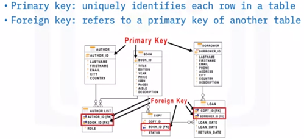
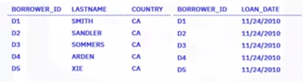
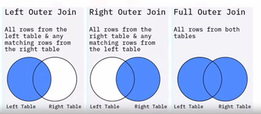
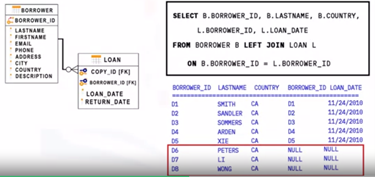
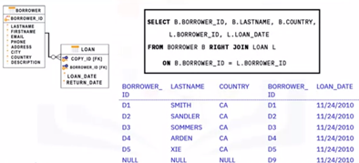
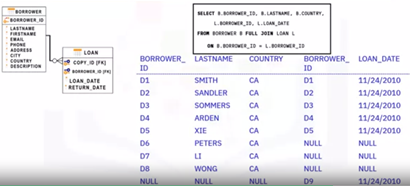

# Working with Multiple Tables
There are 3 main ways of accessing multiple tables in the same query:
1. Sub-queries
2. Implicit `JOIN`
3. `JOIN` operators (`INNER JOIN`, `OUTER JOIN`, etc.)

A `JOIN` combines the rows from two or more tables based on a relationship between certain columns in these tables. 
The column/s in each table to be used as a link between the tables must first be identified, and to do this, a join is usually created between a **primary key** in one table and a **foreign key** in another.

  

## `INNER JOIN`
An `INNER JOIN` displays only the rows from two tables that have matching value in a common column, usually the primary key of one table that exists as a foreign key in the second table.

For example, to retrieve a list of all people who are borrowing books, and the date of the loan, data is needed from the `borrower` table and the `loan` table. 
- In the `FROM` clause, specify the join between the `borrower` table and the `loan` table as `BORROWER INNER JOIN LOAN`. 
- Identify the `borrower` table as `B`, and the `loan` table as `L` (and use these aliases). 
- The table specified on the left of the `JOIN` clause is known as the left table – in this case, the `borrower` table is the left table. 
- For this join, select borrower ID, last name, and country from the `borrower` table, and the borrower ID and the loan date from the `loan` table. 
- In the `ON` clause, specify the `JOIN` predicate, in this case the condition that the borrower ID in the borrower table is equal to the borrower ID in the loan table. 

  

The result set shows only the rows from both tables that have the same borrower ID. The rows are displayed if they `Borrower_Id` matches. Rows with `Borrower_IDs` that do not match are not displayed.

  

``
``The `Borrower_Id`, `Lastname`, and Country columns are taken from the `Borrower` table and joined to the `Borrower_Id` and `Loan_Date` columns from the Loan table to make the result set.

## `OUTER JOIN`
Outer joins, like inner joins, return the rows from each table that have matching values in the join columns. Unlike inner joins, outer joins also return the rows that do not have a match between the tables. 

SQL offers three types of outer joins: 
- `LEFT OUTER JOIN`
- `RIGHT OUTER JOIN`
- `FULL OUTER JOIN`

  

### `LEFT JOIN` Operator
A left outer join returns all the rows from the left table, and any matching rows from the right table. An example is shown below:

  
  

- The Borrower table is the first table specified in the `FROM` clause of the `SELECT` statement, so the `Borrower` table is the `LEFT` table, and the `Loan` table is the `RIGHT` table.
- In the `FROM` clause, `Borrower` is listed on the left side of the join operator, therefore all rows from the `Borrower` table will be selected and combined with the contents of the `Loan` table based on the criteria specified in the query. 
- In this example, the criteria is the `BORROWER ID` column. For a `LEFT OUTER JOIN`, simply called a `LEFT JOIN`, the following columns from the `Borrower` table will be selected: `BorrowerID`, `LastName`, and `Country`, and the following columns will also be selected from the `Loan` table: `BorrowerID`, and `LoanDate`. 
- The `LEFT JOIN` selects each `BORROWER ID` in the Borrower table and displays the `LoanDate` from the `Loan` table. The result set shows each Borrower ID from the borrower table, and the loan date for that borrower. For example, there is no loan date for the last three rows, so the borrower ID and loan date show null values.

### `RIGHT JOIN` Operator
A right outer join returns all the rows from the right table, and any matching rows from the left table. An example is shown below:

  

- In the `FROM` clause, the `Loan` table is listed on the right side of the join operator, therefore all rows from the Loan table will be selected and combined with the contents of the `Borrower` table based on the criteria specified in the query. 
- The criteria is the `BORROWER_ID` column. For a `RIGHT JOIN`, the following columns will be selected from the `Loan` table: `Borrower_ID`, and `LoanDate`, and the following columns will also be selected from the `Borrower` table: `Borrower_ID`, `LastName`, and `Country` where the `Borrower_ID` in the `Loan` table matches the `Borrower_ID` in the `Borrower` table. 
- The result set shows each `Borrower_ID` from the `Loan` table and the `LoanDate` for that `Borrower`, where the `Borrower_ID` in the `Loan` table also exists in the `Borrower` table. 
- For the last row, there is no matching row in the `Borrower` table, so the `Borrower_ID`, `Lastname`, and `Country` show null values. This could indicate a problem for the library; it indicates there is a book on loan to an unknown person.

### `FULL JOIN` Operator
A full outer join, or full join, returns all rows from both tables. An example is shown below:

  

- For a `FULL JOIN`, all rows are selected from the `Borrower` table and all rows from the `Loan` table are also selected. 
- The result set shows all eight records from the `Borrower` table listed with the corresponding data from the `Loan` table. 

