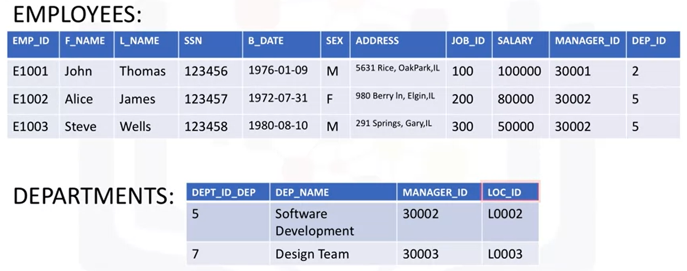

# Working with Multiple Tables
There are 3 main ways of accessing multiple tables in the same query:
1. Sub-queries, introduced [here](https://github.com/DanielBarnes18/IBM-Data-Science-Professional-Certificate/tree/main/06.%20Databases%20and%20SQL%20for%20Data%20Science%20with%20Python/03.%20Intermediate%20SQL/03.%20Sub-Queries%20and%20Nested%20SELECTS)
2. Implicit `JOIN`
3. `JOIN` operators (`INNER JOIN`, `OUTER JOIN`, etc.)

This section will only consider the first two methods, as the latter is covered in the following module: [Bonus Module - Advanced SQL for Data Engineering](https://github.com/DanielBarnes18/IBM-Data-Science-Professional-Certificate/tree/main/06.%20Databases%20and%20SQL%20for%20Data%20Science%20with%20Python/06.%20Bonus%20Module%20-%20Advanced%20SQL%20for%20Data%20Engineering)

## Multiple Tables with Sub-Queries
To explain sub-queries with multiple tables, the following tables will be used in some examples.

  

To retrieve only the employee records that correspond to departments in the `DEPARTMENTS` table:

    SELECT * FROM EMPLOYEES
      WHERE DEP_ID IN
        (SELECT DEPT_ID_DEP FROM DEPARTMENTS) ;
        
To retrieve only the list of employees from a specific location:
- `EMPLOYEES` table does not contain location information
- Need to get location information from `DEPARTMENTS` table
To do so:

    SELECT * FROM EMPLOYEES
      WHERE DEP_ID IN 
        (SELECT DEPT_ID_DEP FROM DEPARTMENTS
          WHERE LOC_ID = 'L0002') ;

To retrieve the department ID and name for employees who earn more than $70,000:  

    SELECT DEPT_ID_DEP, DEP_NAME FROM DEPARTMENTS
      WHERE DEPT_ID_DEP IN
        (SELECT DEP_ID FROM EMPLOYEES
          WHERE SALARY > 70000 ) ;
          
## Implicit Join
To access multiple tables using an Implicit Join, specify 2 tables in the `FROM` clause, e.g.
  
    SELECT * FROM EMPLOYEES, DEPARTMENTS ;
    
The result is a full join (or Cartesian join):
- Every row in the first table is joined with every row in the second table
- The result set will have more rows than in both tables

To limit the result set, additional operands can be used, such as

    SELECT * FROM EMPLOYEES, DEPARTMENTS
      WHERE EMPLOYEES.DEP_ID = DEPARTMENTS.DEPT_ID_DEP ; 
      
This notation can also be shortened by using aliases for table names, so that it becomes:

    SELECT * FROM EMPLOYEES E, DEPARTMENTS D
      WHERE E.DEP_ID = D.DEPT_ID_DEP ;
      
These aliases can also be used in the select clause itself, in examples such as 

    SELECT E.EMP_ID, D.DEP_ID FROM 
      EMPLOYEES E, DEPARTMENTS D
        WHERE E.DEP_ID = D.DEPT_ID_DEP
        
        
      
      
      
      

          
