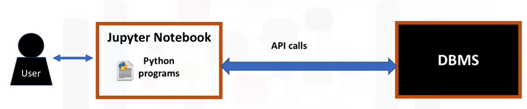
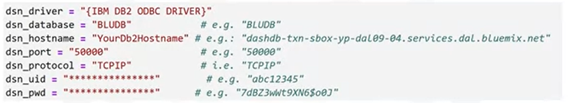

# Accessing Databases using Python

## How to Access Databases using Python

Accessing databases using Python allows for other big data tools such as Apache Spark, or python packages such as Pandas, Scikit-learn, and TensorFlow, to be used with the data retrieved.

In order to communicate with the DBMS, the Python code connects to the database using DB-API calls. 
*DB-API* is Python's standard API for accessing relational databases. It is a standard that allows for a single program to work with multiple kinds of relational databases, instead of writing a separate program for each one, i.e the DB-API functions can be used on any database with Python. This API has also been defined to encourage similarity between the Python modules that are used to access databases. It achieves consistency which leads to more easily understood modules. 
The code is generally more portable across databases, and it has a broader reach of database connectivity from Python. 

  

To pass SQL statements to the DBMS, an application program calls functions in the API, and it calls other functions to retrieve query results and status information from the DBMS.
SQL APIs typically following the following steps to function:
1. The application program begins its database access with one or more API calls that connect the program to the DBMS. 
2. To send the SQL statement to the DBMS, the program builds the statement as a text string in a buffer and then makes an API call to pass the buffer contents to the DBMS.
3. The application program makes API calls to check the status of its DBMS request and to handle errors.
4. The application program ends its database access with an API call that disconnects it from the database.

Some of the proprietary APIs used by popular SQL-based DBMS systems are as follows:

| Application or Database  | SQL API |
| ------------- | ------------- |
| MySQL| MySQL C API |
| PostgresSQL | psycopg2  |
| IBM DB2| ibm_db |
| SQL Server | dblib API | 
| Database access for Microsoft Windows OS | ODBC | 
| Oracle | OCI | 
| Java | JDBC | 

This course will make use of the **IBM DB2** Database, and therefore will also use the **ibm_db** SQL API, and **DB-API**

## Writing Code using DB-API
The two main concepts in the Python DB-API are **connection objects** and **query objects**. 

Connection objects are used to connect to a database and manage transactions. 
Cursor objects are used to run queries. A cursor object is opened, then a query is run. It works similarly to a cursor in a text processing system where you scroll down in your result set and get your data into the application. Cursors are used to scan through the results of a database. 
The DB_API includes a connect constructor for creating a connection to the database. It returns a Connection Object, which is then used by the various connection methods. 

These connection methods are: 
- The `cursor()` method, which returns a new cursor object using the connection
- The `commit()` method, which is used to commit any pending transaction to the database.
- The `rollback()` method, which causes the database to roll back to the start of any pending transaction.
- The `close()` method, which is used to close a database connection.

These objects represent a database cursor, which is used to manage the content of a fetch operation. 
Cursors created from the same connection are not isolated that is, any changes done to the database by a cursor are immediately visible by the other cursors. 
Cursors created from different connections can or cannot be isolated depending on how the transaction support is implemented.
A database cursor is a control structure that enables traversal over the records in a database. It behaves like a file name or file handle in a programming language. Just as a program opens a file to access its contents, it opens a cursor to gain access to the query results. 
Similarly, the program closes a file to end its access and closes a cursor to end access to the query results. 
Another similarity is that just as file handle keeps track of the program's current position within an open file, a cursor keeps track of the program's current position within the query results. 

### Concepts of the Python DB API
- Connection Objects
  - Database connections
  - Manage transactions
- Cursor Objects
  - Database Queries
  - Scroll through result set
  - Retrieve results
  
  
## Querying a database using DB-API
The steps of querying a database using the DB-API are as follows

1. Import the database module by using the connect API from that module. 
    
          from dbmodule import connect
    
2. To open a connection to the database, you use the connect constructor and pass in the parameters, that is, the database name, username, and password. The connect function returns a connection object. 

          Connection = connect('databasename', 'username', 'password')

3. Create a cursor object on the connection object. The cursor is used to run queries and fetch results. 

          Cursor = Connection.cursor()
    
4. Run the queries

          Cursor.execute('select * from mytable')
    
5. After running the queries, use the cursor to fetch all of the results of the query. 

          Results = Cursor.fetchall()
    
6. Finally, when the system is done running the queries, free all resources by closing the connection. It is always important to close connections to avoid unused connections taking up resources. 

          Cursor.close()
          Connection.close()
          
          
          
          
## Connecting to a Database using ibm_db API

The ibm_db API provides a variety of useful Python functions for accessing and manipulating data in an IBM data server database, including functions for connecting to a database, preparing and issuing SQL statements, fetching rows from result sets, calling stored procedures, committing and rolling back transactions, handling errors and retrieving metadata. 

- Following the steps in the previous section, the first step is to import the ibm_db library 
- The second is to open a connection to the DB2 database, and to do so, the following credentials are needed to connect to the database:

  

- The following steps can be seen in the notebook files within this folder.

## SQL Magic
Jupyter notebooks have a concept of Magic commands that can simplify working with Python, and are particularly useful for data analysis. Your notebooks can have two types of magic commands:

- Cell magics: start with a double %% sign and apply to the entire cell
- Line magics: start with a single % (percent) sign and apply to a particular line in a cell

Their usage is of the format:

        %magicname arguments

The SQL Magic commands can be used to execute queries more easily than by using the Python DB-API. For example to execute a query to select some data from a table and fetch its results, the following line in a Jupyter notebook cell will do:

        %sql select * from tablename

Although SQL magic simplifies working with databases, it has some limitations. For example, unlike DB-API, there are no explicit methods to close a connection and free up resources.

## Using Jupyter Notebooks

The first step in Jupyter notebooks is always to install all the necessary libraries, and for accessing databases using SQL, these are neeeded:

        !pip install sqlalchemy
        !pip install ibm_db_sa
        !pip install ipython-sql

  
  
  
