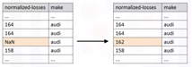
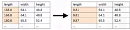
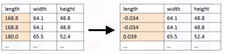
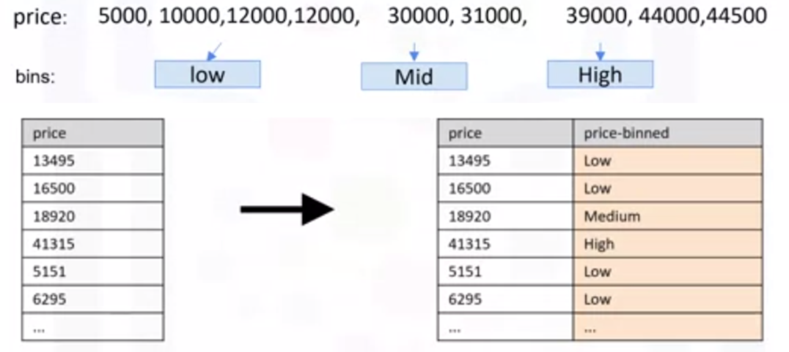
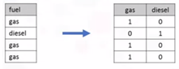
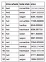
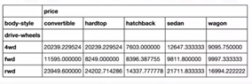
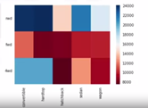

# Data Wrangling

Data wrangling is the process of converting data from the initial format to a format that may be better for analysis, so naturally, this lab involves the following activities:
- Identifying and handling missing values
- Data standardization
- Data normalization (centering/scaling)
- Binning
- Labelling categories using indicator variables (dummy variables)

The output of this data wrangling is the `02. Data Wrangling - clean_df.csv` file. 

The methods of data wrangling mentioned above are shown in the sections below.

## Missing values
### Dropping Missing values
To drop missing values, use `dataframe.dropna()`. This won't change the dataframe, unless the parameter `inplace = True` is used, i.e.

	dataframe.dropna(inplace=True)

The argument `axis=0` will drop the entire row, and `axis=1` will drop the entire column, i.e.

	dataframe.dropna(axis=1, inplace=True)

### Replacing Missing values
To replace missing values, use 

	dataframe.replace(missing_value, new_value)

  

## Correcting Data Types
### Identifying Data Types
To identify data types, use 

	dataframe.dtypes()

### Converting Data Types
To convert datatypes, use

	dataframe[column_name].astype(new_data_type)

For example, converting data type of the column 'price' to integer would be 

	df['price'] = df['price'].astype('int')

## Normalising Data
The following are ways to normalise data, and each type has its own use case.
### Simple Feature Scaling

	df['column'] = df['column']/df['column'].max()

  

### Min-Max

	df['column'] = (df['column'] - df['column'].min())/(df['column'].max()-df['column'].min())

  

### Z-Score
	df['column'] = (df['column']-df['column'].mean())/df['column'].std()

  

## Binning Data
Binning data is grouping of values into "bins". It converts numeric data into categorical variables, e.g. if item prices varies between £5,000 and £50,000, they can be placed into "low", "medium", and "high" priced items, by defining the bin ranges.

To group into `N` bins, we need `N+1` numbers as dividers that are equal distance apart. 
To do so, use the numpy function `linspace` to return the array "bins" that contains `N+1` equally spaced numbers over the specified interval of the price. 
A list can then be created that contains the different bin names and the pandas function `cut` can be used to segment and sort the data values into bins.

So, for the low, medium, high example:

	bins = np.linspace(min(df['price']), max(df['price']), 4)

	group_names = ['Low', 'Medium', 'High']

	df['price_binned'] = pd.cut(df['price'] bins, labels=group_names, include_lowest=True)

  

Note that histograms are a good visualization for data split into bins

## One-Hot Encoding
One-hot encoding allows us to go from categorial variables to numerical variables, by adding dummy variables for each unique category and assigning a 0 or 1 in each category.

To do this with Pandas, use the method

	pandas.get_dummies()
		
E.g. for a column 'fuel' with values of 'petrol' and 'diesel', the following code will create 2 columns called 'petrol' and 'diesel', and assign 0s and 1s in each row depending on which value appeared in the 'fuel' column.

	pd.get_dummies(df['fuel'])

  

### Grouping Data
#### groupby Method 
The Pandas method 

	dataframe.groupby()

can be applied on categorical variables, and groups the data into categories. An aggregate function, e.g. `.mean()` can also be applied. For example:

	df_test = df[['drive_wheels', 'body_style', 'price']]

	df_grp = df_test.groupby(['drive_wheels', 'body_style'], as_index = False).mean()

  

#### pivot Method
The Pandas `pivot` method can be used to show 1 variable displayed along the columns and the other variables displayed along the rows, and the syntax is as follows:

	df_pivot = df.pivot(index = 'drive_wheels', columns = 'body_style')
		

  

A useful way to visualise this is by using a heatmap, so using matplotlib:

	import matplotlib.pyplot as plt
	plt.pcolor(df_pivot, cmap = 'RdBu')
	plt.colorbar()
	plt.show()

  

