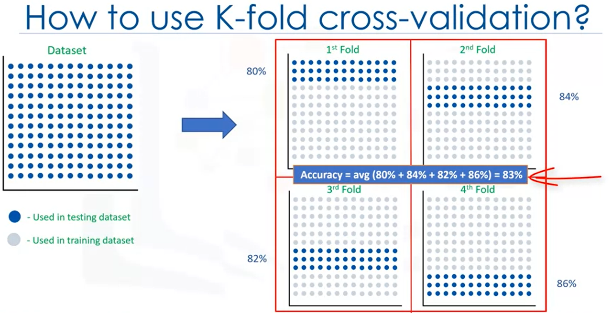

# Regression

## Definition
Regression is the process of predicting a continuous value, and the goal of regression is to build a model to accurately predict an unknown case.

In regression there are two types of variables:
- A dependent variable (`Y`)- the state, target, or final goal we study and try to predict
- One or more independent variables (`X`) - explanatory variables that can be seen as the causes of those states

A regression model relates `Y`, the dependent variable to a function of `X` i.e. the independent variables. The key point in the regression is that our dependent value should be continuous and cannot be a discrete value. However, the independent variable, or variables, can be measured on either a categorical or continuous measurement scale. 

## Types of Regression

There are 2 major types of regression models:
- Simple regression
- Multiple regression

Linearity of regression is based on the nature of relationship between independent and dependent variables. When there is only one independent variable (`X`), the process is simple regression. When there is more than one independent variable present, the process is called multiple linear regression.

### Simple Regression
Simple regression is when one independent variable is used to estimate a dependent variable. It can be either linear or non-linear. For example, predicting CO2 emission using the variable of engine size.
- Independent Variable (`X`): Engine size
- Dependent Variable (`Y`): CO2 emission

### Multiple Regression
If we were to predict CO2 emission using engine size *and* the number of cylinders in any given car, there are 2 dependent variables, so this is multiple regression.
- Independent Variables (`X`): Engine size, Number of Cylinders
- Dependent Variable (`Y`): CO2 emission

Again, depending on the relation between dependent and independent variables it can be either linear or non-linear regression. 

## Types of Non-Linear Regression 
### Polynomial Regression
Sometimes, the trend of data is not really linear, and looks curvy. In this case we can use Polynomial regression methods. In fact, many different regressions exist that can be used to fit whatever the dataset looks like, such as quadratic, cubic, and so on, and it can go on and on to infinite degrees.
In essence, we can call all of these, polynomial regression, where the relationship between the independent variable x and the dependent variable `y` is modeled as an nth degree polynomial in `x`.

### Non-Linear Regression
Non-linear regression is a method to model the non-linear relationship between the independent variables `x` and the dependent variable `y`. Essentially any relationship that is not linear can be termed as non-linear, and is usually represented by the polynomial of `k` degrees (maximum power of `x`). 
Non-linear functions can have elements like exponentials, logarithms, fractions, and so on.

## Model Evaluation in Regression Models

When considering evaluation models, we clearly want to choose the one that will give us the most accurate results. So, the question is, how can we calculate the accuracy of our model? In other words, how much can we trust this model for prediction of an unknown sample using a given dataset and having built a model such as linear regression? 

There are two types of evaluation approaches that can be used to achieve this goal. These approaches are train and test on the same dataset and train/test split. 

To compare the two approaches, we consider two main metrics of prediction: training accuracy and out-of-sample accuracy.

- Training accuracy is the percentage of correct predictions that the model makes when using the test dataset. However, a high training accuracy isn't necessarily a good thing. For instance, having a high training accuracy may result in an over-fit the data. This means that the model is overly trained to the dataset, which may capture noise and produce a non-generalized model.
- Out-of-sample accuracy is the percentage of correct predictions that the model makes on data that the model has not been trained on. Doing a train and test on the same dataset will most likely have low out-of-sample accuracy due to the likelihood of being over-fit. It's important that our models have high out-of-sample accuracy because the purpose of our model is, of course, to make correct predictions on unknown data.

### Train and test on the same dataset
Consider the first approach, where we select a portion of our dataset for testing. Essentially, the name of this approach says it all. The model is trained on the *entire dataset*, then tested using a portion of the same dataset.

For instance, assume that we have 10 records in our dataset. 
- We use the *entire dataset* for training, and we build a model using this training set. 
- Now, we select a small portion of the dataset, such as row number six to nine, but without the labels.  This set is called a test set, which has the labels, but the labels are not used for prediction and is used only as ground truth. The labels are called actual values of the test set. 
- Now we pass the feature set of the testing portion to our built model and predict the target values. 
- Finally, we compare the predicted values by our model with the actual values in the test set. This indicates how accurate our model actually is. 

There are different metrics to report the accuracy of the model, but most of them work generally based on the similarity of the predicted and actual values.

To calculate the accuracy of our regression model, we can just compare the actual values, `y`, with the predicted values, . The error of the model is calculated as the average difference between the predicted and actual values for all the rows. We can write this error as an equation: 

In a general sense, when you test with a dataset in which you know the target value for each data point, you're able to obtain a percentage of accurate predictions for the model. This evaluation approach would most likely have a *high training accuracy* and the *low out-of-sample accuracy*, since the model knows all of the testing data points from the training. 

### Train/Test Split
One way to improve the low out-of-sample accuracy is to use another evaluation approach called train/test split. 
Train/test split involves *splitting the dataset* into training and testing sets respectively, which are mutually exclusive. After which, you train with the training set and test with the testing set.

- In this approach, we select a portion of our dataset for training, for example, row zero to five, and the rest is used for testing, for example, row six to nine.
- The model is built on the training set.
- Then, the test feature set is passed to the model for prediction. 
- Finally, the predicted values for the test set are compared with the actual values of the testing set. 

This will provide a more accurate evaluation on out-of-sample accuracy because the testing dataset is not part of the dataset that has been used to train the data. It is more realistic for real-world problems. This means that we know the outcome of each data point in the dataset, making it great to test with. Since this data has not been used to train the model, the model has no knowledge of the outcome of these data points. So, in essence, it's truly out-of-sample testing. However, the model must also be trained with the testing set afterwards, so that no potentially valuable data is lost. 

The issue with train/test split is that it's highly dependent on the datasets on which the data was trained and tested. The variation of this causes train/test split to have a *better out-of-sample prediction* than training and testing on the same dataset, but it still has some problems due to this dependency.

### K-Fold Cross Validation
Another evaluation model, called K-fold cross-validation, resolves most of these issues. To fix a high variation that results from a dependency, you can just average it.

- If we have `K=4` folds, then we split up the dataset into 4. 
- In the first fold for example, we use the first 25 percent of the dataset for testing and the rest for training. 
- The model is built using the training set and is evaluated using the test set. 
- Then, in the next round or in the second fold, the second 25 percent of the dataset is used for testing and the rest for training the model. 
- Again, the accuracy of the model is calculated. 
- Repeat for all folds, then the result of all four evaluations are averaged. That is, the accuracy of each fold is then averaged, keeping in mind that each fold is distinct, where no training data in one fold is used in another. 

K-fold cross-validation in its simplest form performs multiple train/test splits, using the same dataset where each split is different. Then, the result is average to produce a more consistent out-of-sample accuracy. 

### Evaluation Metrics in Regression Models\n",
Evaluation metrics are used to explain the performance of a model, and they provide a key role in the development of a model as it provides insight to areas that require improvement In the context of regression, the error of the model is the difference between the data points and the trend line predicted by the algorithm. Since there are multiple data points, an error can be determined in multiple ways.
    

Each of the following metrics can be used for quantifying of your prediction. The choice of metric completely depends on the type of model, the data type, and domain of knowledge.

#### Mean Absolute Error (MAE)
Mean Absolute Error is the mean of the absolute value of the errors. This is the easiest of the metrics to understand, since it's just the average error.

#### Mean Squared Error (MSE)
Mean Squared Error is the mean of the squared error. It's more popular than Mean Absolute Error because the focus is geared more towards large errors. This is due to the squared term, exponentially increasing larger errors in comparison to smaller ones.

#### Root Mean Squared Error (RMSE)
Root Mean Squared Error is the square root of the mean squared error. This is one of the most popular of the evaluation metrics because Root Mean Squared Error is interpretable in the same units as the response vector or Y units, making it easy to relate its information.

#### Relative Absolute Error (RAE)
Relative absolute error, also known as residual sum of square, where $\\bar{y} is a mean value of `y`, takes the total absolute error and normalizes it by dividing by the total absolute error of the simple predictor.

#### Relative Squared Error (RSE)
Relative squared error is very similar to relative absolute error, but is widely adopted by the data science community as it is used for calculating `R^2`. `R^2` is not an error per say but is a popular metric for the accuracy of your model. It represents how close the data values are to the fitted regression line. The higher the `R^2`, the better the model fits your data.

