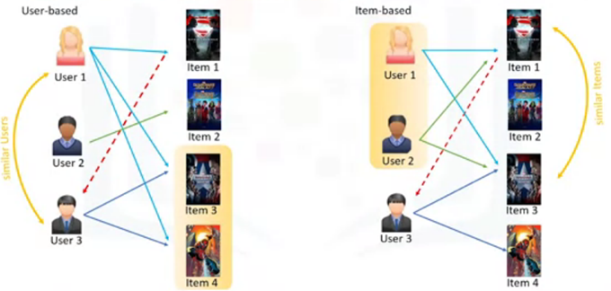
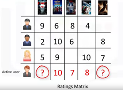
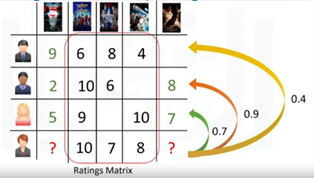
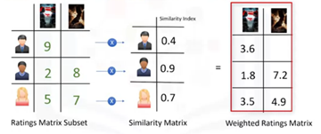
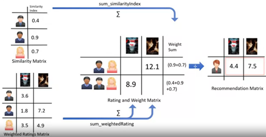

# Collaborative Filtering 
Collaborative filtering is based on a user saying, “Tell me what's popular among my neighbors because I might like it too.” Collaborative filtering techniques find similar groups of users, and provide recommendations based on similar tastes within that group. In short, it assumes that a user might be interested in what similar users are interested in. 

It is based upon the fact that relationships exist between products and people's interests. Many recommendation systems use collaborative filtering to find these relationships and to give an accurate recommendation of a product that the user might like or be interested in. Collaborative filtering has 2 approaches: 
1. User-based, based on the user similarity or neighborhood
2. Item-based, based on similarity among items

  

## User-based Collaborative Filtering

  

The following steps are required to perform user-based collaborative filtering:
1. Calculate the similarity weight between users.
2. Create a weighted rating matrix. This gives more weighting to users that are similar to the active user.
3. Generate the recommendation matrix by aggregating all of the weighted rates. The weighted rating values must be normalised as different numbers of users rated different items. This is done by dividing it by the sum of the similarity index for users.

The result is the potential rating that our active user will give to new items based on their similarity to other users.

### Worked Example

#### Assumptions
- Assume that we have a simple user item matrix, which shows the ratings of 4 users for 5 different movies. 
- Also assume that the active user has watched and rated 3 out of these 5 movies.

  

- To find out which of the other 2 movies (that haven't been watched) should be recommended, the first step is to discover how similar the active user is to the other users. This similarity can be quantified through several different statistical and vectorial techniques such as distance or similarity measurements including Euclidean Distance, Pearson Correlation, Cosine Similarity, and so on. 

#### Similarity Weight
- To calculate the level of similarity between two users, we use the 3 movies that both the users have rated in the past. 
- One of the aforementioned measurements is performed to give a a similarity measurement, such that here, the similarities are 0.7, 0.9, and 0.4 between the active user and other users. These numbers represent similarity weights or proximity of the active user to other users in the dataset. 

  

#### Weighted Rating Matrix
- The next step is to create a weighted rating matrix. 
- Multiply the similarity weights by the user ratings. This results in a weighted ratings matrix, which represents the user's neighbors opinion about the two candidate movies for recommendation. 

  

- In fact, it incorporates the behaviour of other users and gives more weight to the ratings of those users who are more similar to the active user. 

#### Recommendation Matrix
- Now, aggregrating all of the weighted rates generates the recommendation matrix. 
- However, as 3 users rated the first potential movie and 2 users rated the second movie, the weighted rating values must be normalised. To do so, divide by the sum of the similarity index for users. The result is the potential rating that the active user will give to these movies based on her similarity to other users. 
- This can be used to rank the movies for providing recommendation to our active user.

  

 

## Item-based Collaborative Filtering
In the user-based approach, the recommendation is based on users of the same neighborhood with whom he or she shares common preferences. In the item-based approach, similar items build neighborhoods on the behavior of users.

## Use Cases
Recommender systems are probably the set of algorithms that are most commonly interacted with in modern life, with sites from Amazon to Netflix using some form of recommendation system/engine to suggest items to buy, films to watch, and to provide a better experience on the web.

Netflix is driven by customer selection, whereby if a certain movie gets viewed frequently enough, the recommender system ensures that that movie gets an increasing number of recommendations.

On social media, sites like Facebook or LinkedIn regularly recommend friendships and connections. Recommender systems are even used to personalize your experience on the web. For example, when you go to a news platform website, a recommender system will make note of the types of stories that you clicked on and make recommendations on which types of stories you might be interested in reading in future. 

## Challenges of Collaborative Filtering
Collaborative filtering is a very effective recommendation system. However, there are some challenges with it as well. 

### Data Sparsity
Data sparsity happens when you have a large data set of users who generally rate only a limited number of items. As mentioned, collaborative based recommenders can only predict scoring of an item if there are other users who have rated it. Due to sparsity, there might not be enough ratings in the user item dataset which makes it impossible to provide proper recommendations. 

### Cold Start 
Cold start refers to the difficulty the recommendation system has when there is a new user, and as such a profile doesn't exist for them yet. Cold start can also happen when we have a new item which has not received a rating. 

### Scalability 
Scalability can become an issue as well. As the number of users or items increases and the amount of data expands, collaborative filtering algorithms will begin to suffer drops in performance, simply due to growth and the similarity computation. There are some solutions for each of these challenges such as using hybrid based recommender systems, but they are out of scope of this course.
