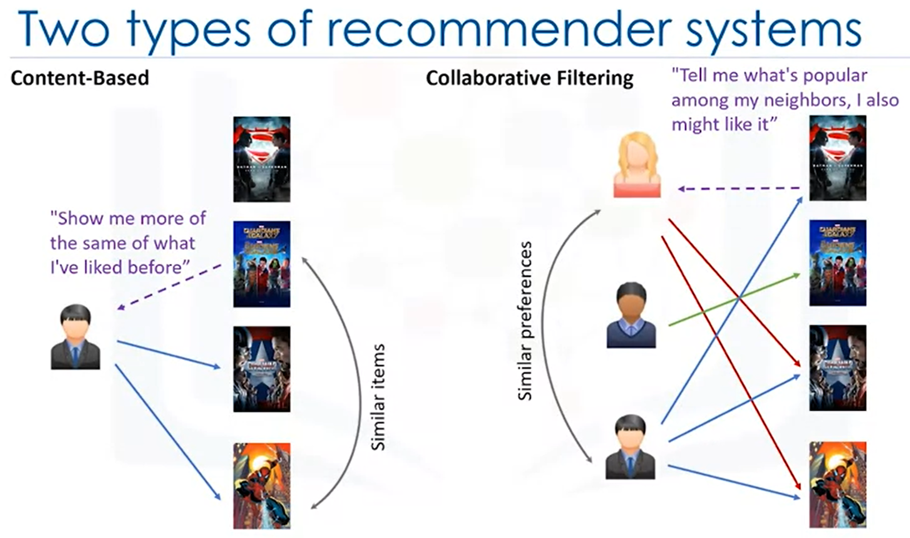

# Recommender Systems

## Definition
Recommender systems capture the patterns of peoples' behaviour and use to predict what else they might want or like. One of the main advantages of using recommendation systems is that users get a broader exposure to many different products they might be interested in. This exposure encourages users towards continual usage or purchase of their product. Not only does this provide a better experience for the user but it benefits the service provider, as well, with increased potential revenue and better security for its customers. 

## Types of Recommender Systems / Recommendation Engines
There are generally 2 main types of recommendation systems: 
1. [Content-based](https://github.com/DanielBarnes18/IBM-Data-Science-Professional-Certificate/tree/main/09.%20Machine%20Learning%20with%20Python/05.%20Recommender%20Systems/01.%20Content-based)
2. [Collaborative filtering](https://github.com/DanielBarnes18/IBM-Data-Science-Professional-Certificate/tree/main/09.%20Machine%20Learning%20with%20Python/05.%20Recommender%20Systems/02.%20Collaborative%20Filtering)

  

Also, there are hybrid recommender systems, which combine various mechanisms. In terms of implementing recommender systems, there are 2 types:
1. Memory-based 
2. Model-based

In memory-based approaches, we use the entire user-item dataset to generate a recommendation system. It uses statistical techniques to approximate users or items. Examples of these techniques include: Pearson Correlation, Cosine Similarity and Euclidean Distance, among others. In model-based approaches, a model of users is developed in an attempt to learn their preferences. Models can be created using Machine Learning techniques like regression, clustering, classification, and so on. 

