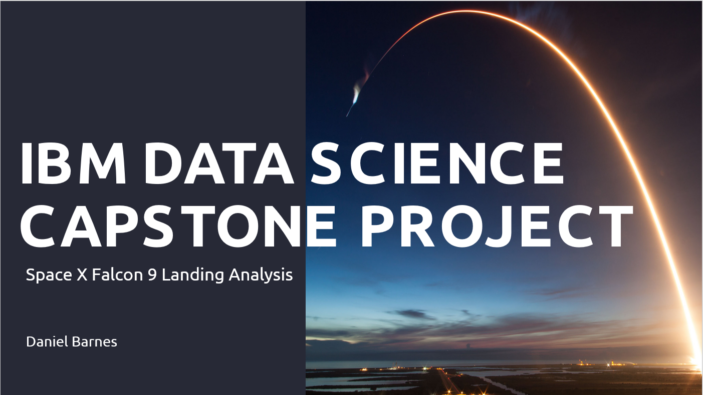

# Applied Data Science Capstone

  

## 📄 Summary
This capstone project will ultimately **predict if the Space X Falcon 9 first stage will land successfully**. 

The full report can be found [here](https://github.com/DanielBarnes18/IBM-Data-Science-Professional-Certificate/blob/main/10.%20Applied%20Data%20Science%20Capstone/IBM%20Data%20Science%20Capstone%20Project%202022.pdf).

### Context and Business Understanding
- SpaceX launches Falcon 9 rockets at a cost of around $62m. This is considerably cheaper than other providers (which usually cost upwards of $165m), and much of the savings are because SpaceX can land, and then re-use the first stage of the rocket. 

- If we can make predictions on whether the first stage will land, we can determine the cost of a launch, and use this information to assess whether or not an alternate company should bid against SpaceX for a rocket launch.

## 📑 Main Topics 
This project follows these steps:
1. [Data Collection](https://github.com/DanielBarnes18/IBM-Data-Science-Professional-Certificate/tree/main/10.%20Applied%20Data%20Science%20Capstone/01.%20Data%20Collection)
    - Making GET requests to the SpaceX REST API
    - Web Scraping
2. [Data Wrangling ](https://github.com/DanielBarnes18/IBM-Data-Science-Professional-Certificate/tree/main/10.%20Applied%20Data%20Science%20Capstone/02.%20Data%20Wrangling)
    - Using the `.fillna()` method to remove NaN values
    - Using the `.value_counts()` method to determine the following:
        - Number of launches on each site
        - Number and occurrence of each orbit
        - Number and occurrence of mission outcome per orbit type
    - Creating a landing outcome label that shows the following:
        - 0 when the booster did not land successfully
        - 1 when the booster did land successfully
3. [Exploratory Data Analysis](https://github.com/DanielBarnes18/IBM-Data-Science-Professional-Certificate/tree/main/10.%20Applied%20Data%20Science%20Capstone/03.%20Exploratory%20Data%20Analysis)
    - Using SQL queries to manipulate and evaluate the SpaceX dataset
    - Using Pandas and Matplotlib to visualize relationships between variables, and determine patterns
4. [Interactive Visual Analytics](https://github.com/DanielBarnes18/IBM-Data-Science-Professional-Certificate/tree/main/10.%20Applied%20Data%20Science%20Capstone/04.%20Interactive%20Visual%20Analytics)
    - Geospatial analytics using Folium
    - Creating an interactive dashboard using Plotly Dash
5. [Predictive Analysis (Classification)](https://github.com/DanielBarnes18/IBM-Data-Science-Professional-Certificate/tree/main/10.%20Applied%20Data%20Science%20Capstone/05.%20Predictive%20Analysis%20(Classification))
    - Using Scikit-Learn to:
        - Pre-process (standardize) the data
        - Split the data into training and testing data using train_test_split
        - Train different classification models
        - Find hyperparameters using GridSearchCV
    - Plotting confusion matrices for each classification model
    - Assessing the accuracy of each classification model

## 🔑 Key Skills Learned/Used 
- Using data science methodologies to define and formulate a real-world business problem
- Using data analysis and data visualisation to load a dataset, clean it, and find out interesting insights from it
- Interactive dashboard development with Plotly Dash
- Interactive map development using Folium
- Using machine learning to build a predictive model to help a business function more efficiently
- Structuring and building a data-findings report

## 🏆 Certificates 
To verify the certificates, click the images to follow the links.

  
  

